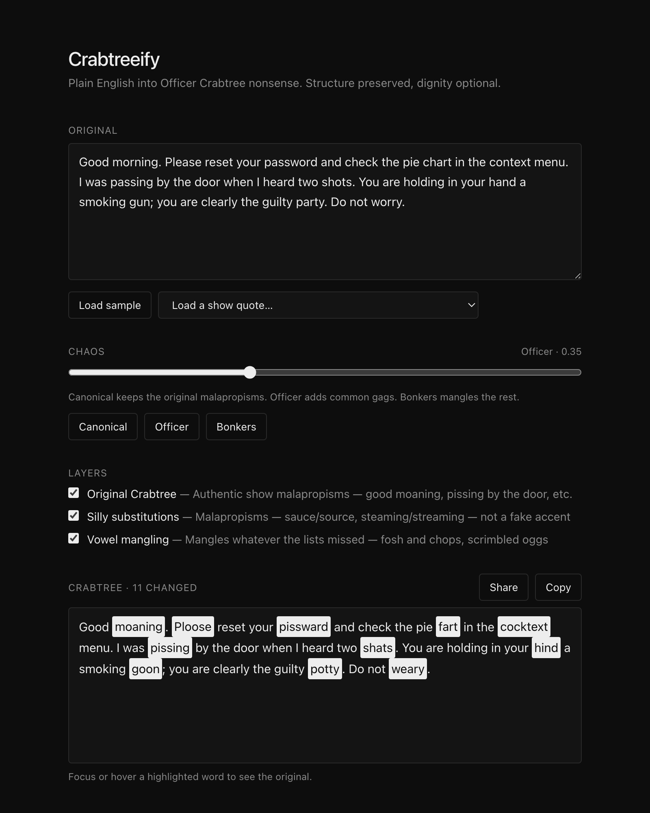

# Crabtreeify

Turn plain English into Officer Crabtree nonsense from _'Allo 'Allo!_, the undercover policeman whose "Good moaning" mangles every vowel. Paste some text, pick a chaos level, and get it back as Crabtree would say it: the show's own lines stay faithful, extra gags join in as chaos rises, and at full chaos the leftover words get their vowels mangled too.

**Live demo: <https://meigo.github.io/crabtreeify/>**



Everything runs in your browser. Text never leaves the page, and share links keep their settings in the URL hash, which browsers do not send to servers.

## Examples

| Settings                     | Plain English                                                                                     | Crabtree                                                                                              |
| ---------------------------- | ------------------------------------------------------------------------------------------------- | ----------------------------------------------------------------------------------------------------- |
| Chaos 0, original only       | Good morning. I was passing by the door when I heard two shots.                                   | Good moaning. I was pissing by the door when I heard two shats.                                       |
| Chaos 0.35, original + silly | Please reset your password and check the pie chart in the context menu.                           | Ploose reset your pissward and check the pie fart in the cocktext menu.                               |
| Chaos 0.35, original + silly | The competent mentor was beaming at the cinema after his annual bonus.                            | The impotent manure was bumming at the enema after his anal penis.                                    |
| Chaos 0.5, original + silly  | Upgraded detectors now generate petabytes of data annually, and manual analysis cannot keep pace. | Upbraided defectors now genitrate peterbytes of dater anally, and manure anal-ysis cannot keep paste. |
| Chaos 0.5, weird only        | Grab your umbrella; the gadgets caused a commotion and I ran away.                                | Grab your bumbershoot; the doohickeys caused a hullabaloo and I skedaddled.                           |
| Chaos 1, all layers          | Good morning. The report from the committee was late, so the meeting was postponed.               | Good moaning. The riport from the cammittee was loot, so the meating was pastponed.                   |

## How it works

The engine (`src/lib/crabtreeify.js`) splits text into words and separators, then runs the enabled layers in order. A layer locks every word it changes, so a later layer can never overwrite a better joke.

1. **Original Crabtree** (`src/lib/rules/canonical.js`) — documented swaps and whole quotes from the show (`good morning` → `good moaning`, `passing` → `pissing`). Applies at every chaos level, and a matched quote locks the whole line.
2. **Silly substitutions** (`src/lib/rules/silly.js`, `malaprop.js`) — malapropisms that land on a different, ruder word (`source` → `sauce`, `direction` → `erection`), unlocked in bands as chaos passes 0.15, 0.45 and 0.8.
3. **Weird words** (`src/lib/rules/weird.js`) — funny-sounding synonyms that are not rude at all (`umbrella` → `bumbershoot`, `fuss` → `kerfuffle`, `ran away` → `skedaddled`). Rarer words swap from chaos 0.15, everyday ones from 0.45.
4. **Vowel mangling** (`src/lib/vowels.js`) — a generative catch-all for whatever is left. It nudges one vowel group towards Crabtree's favourite vowels and prefers any swap that lands on a jackpot word from `src/lib/rules/targets.js` (`pass` → `piss`, `baby` → `booby`). Chaos sets how many words it touches, and names are spared until full chaos.

Rules match whole words and their simple inflections (`src/lib/morphology.js`): `publicly` → `pubicly`, `banking` → `bonking`, `dropped` → `dripped`, with the result spelled like English (`knobbing`, `manured`, `willies`). The original word's capitalisation is kept.

## Features

- Chaos slider with Canonical, Officer and Bonkers presets
- Switch each layer on or off
- Changed words are highlighted; hover or focus one to see the original
- Load sample text or a documented show quote
- Copy the output, or copy a share link with the text and settings
- Command-line version for scripts and quick checks

## Development

```bash
npm install
npm run dev            # local web UI
npm test               # engine tests (node:test), then UI tests (Vitest + Testing Library)
npm run check          # lint, format check, tests, then build
npm run lint           # eslint (JS, Svelte, Tailwind class conflicts)
npm run format         # prettier; format:check only reports
npm run build          # static site in dist/
```

A husky pre-commit hook runs ESLint and Prettier on staged files.

### Command line

```bash
npm run cli -- "Good morning."                              # Good moaning.
CHAOS=1 npm run cli -- "Good morning. Please take a seat."  # Good moaning. Ploose toke a soot.
```

The CLI enables every layer and uses chaos `0.7` unless `CHAOS` is set.

### Growing the joke list

```bash
npm run eval            # coverage, jackpot and untouched-word report over sample texts
npm run suggest         # dictionary words one letter from a punchline (offline, /usr/share/dict/words)
npm run suggest:sounds  # common words that sound like a punchline, ranked by frequency (Datamuse API)
```

Suggestions are a starting point, not data: pick the ones that read as a joke in a sentence. The tests reject hyphen-only swaps that do not change how a word sounds, and inflected rules whose base form has no rule.

## Limitations

- English only, and the rules are hand-curated, so plenty of words stay untouched below full chaos.
- Phrase matches do not cross sentence-ending punctuation. Rules match whole words and their simple inflections, so `chartreuse` is left alone.
- Inflection is heuristic; rare forms can come out odd (`tightly` → `titly`).
- Vowel mangling only touches plain ASCII words. Accented words change only through explicit rules (`René` → `Ronnie`).
- Very long input is left out of share links.

## Credits

- Officer Crabtree was played by Arthur Bostrom in the BBC sitcom _'Allo 'Allo!_ (1982–1992). The original swaps and quotes were collected from Wikipedia, the _'Allo 'Allo!_ Fandom wiki and IMDb. This is an unofficial fan parody, not affiliated with the BBC or the show's makers.
- Some silly substitutions and jackpot words were found with the [Datamuse API](https://www.datamuse.com/api/) and [Related Words](https://relatedwords.org/).
- Weird words come from the funny-word lists at [Busuu](https://www.busuu.com/en/english/funny-words) and [Parade](https://parade.com/1195613/marynliles/funny-words/).
- Built with [Svelte 5](https://svelte.dev/), [Vite](https://vite.dev/) and [Tailwind CSS](https://tailwindcss.com/).

## License

[MIT](LICENSE)
